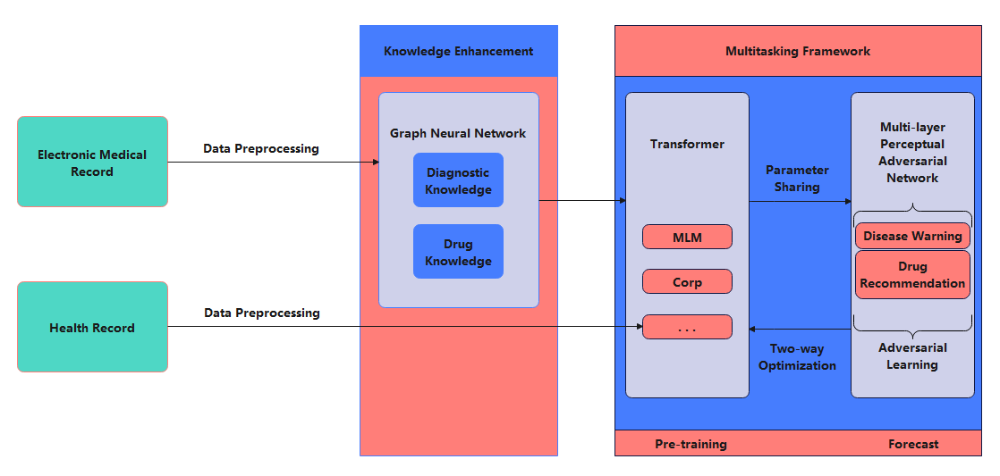

⮚	Processed large volumes of textual dataset via data mining and word segmentation techniques                                                         
⮚	Constructed the testing and training dataset with extracted key information                                                                       
⮚	Participated the hypertension early warning model based on Health Electronic Records dataset research   
⮚	Conducted the analysis, evaluation benchmark and test work on warning model                                                              

Technology Roadmap
======

